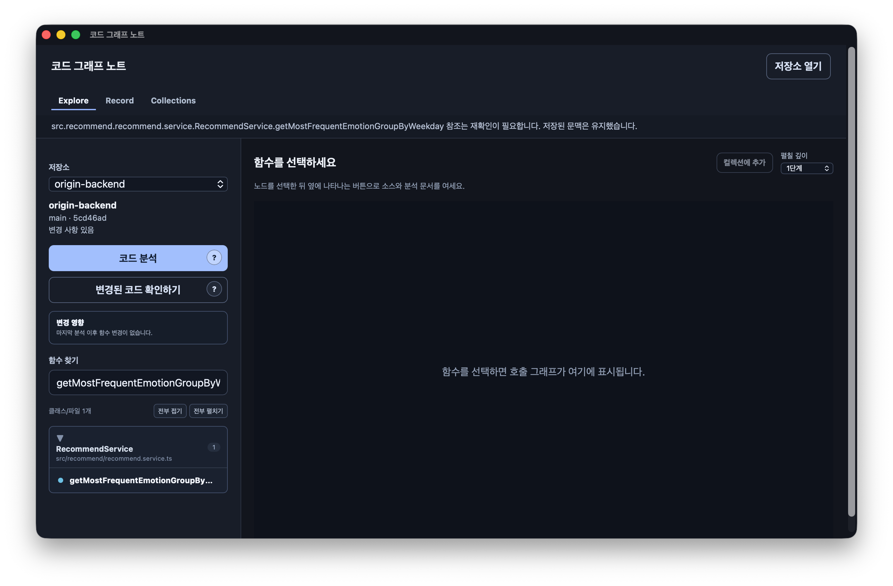
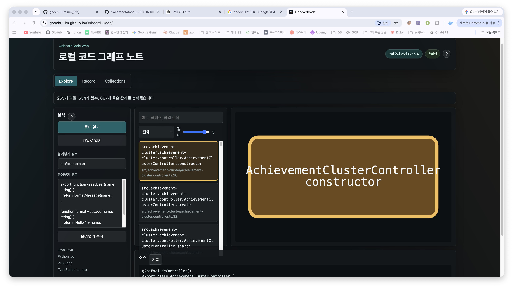
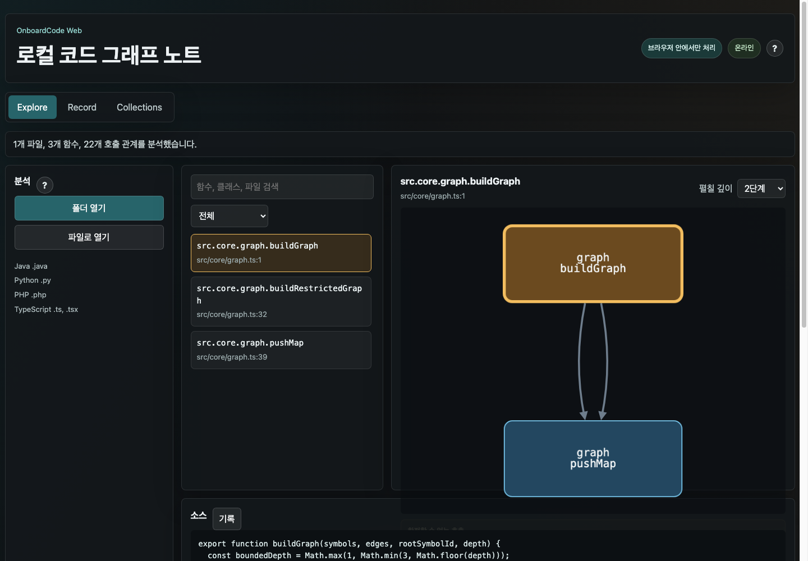

# Web and Desktop UI Consistency Audit

Date: 2026-09-06

## Audit scope

- Surface: OnboardCode `Explore`
- Flow: open/analyze a repository, find a function, select it, inspect its call graph
- Reference: the desktop app is the product source of truth
- Captures: the running Tauri desktop app, the deployed web app before the fix, and the local web app after the graph fix

## User goal and accessibility target

The same task should feel like the same product on desktop and web. Browser-only
privacy and capability differences must remain visible, but they should not
change the navigation model, information hierarchy, component vocabulary, or
selected-function feedback. The flow must remain usable with keyboard focus,
clear status text, and responsive reflow.

## Captured steps

### 1. Desktop Explore reference — healthy reference, graph state needs clearer empty explanation

- Compact application header, underline navigation, persistent status strip,
  320px repository/function sidebar, and one dominant graph workspace form a
  clear hierarchy.
- Search results are grouped by class/file and expose expand/collapse actions.
- The graph header reserves space for the selected symbol, collection action,
  and depth control.
- In the captured state the selected function has no visible related nodes, but
  the empty graph area does not explain whether the function has no calls, the
  calls are unresolved, or the selection needs refreshing.

### 2. Deployed web Explore before the fix — inconsistent and misleading

- The large marketing-style hero, floating pill navigation, independent status
  card, and three-column card grid do not match the desktop application shell.
- Repository actions and function search are split into different panels, while
  desktop treats them as one exploration sidebar.
- Direct source paste occupies much of the primary sidebar despite not being a
  product requirement.
- A selected function can render as one oversized node with no explanation.
  Unresolved calls are omitted from the visible UI.
- The visual palette is green/teal while desktop uses slate/blue tokens, making
  the two builds look like separate products.

### 3. Web Explore after the immediate graph fix — functionally healthy, visual convergence pending

- Direct source paste is gone; folder and file selection are the only entry
  points.
- Selecting `src.core.graph.buildGraph` renders the related `pushMap` node and
  visible edges.
- The selected symbol, location, and depth control now appear above the graph.
- Calls that cannot be resolved are listed with a reason instead of disappearing.
- The remaining shell, navigation, column model, typography, spacing, colors,
  symbol list, and source placement still differ materially from desktop.

## Strengths

- Both builds now use the same three workspace names: Explore, Record, and
  Collections (`apps/desktop/src/App.tsx:856`, `apps/web/src/App.tsx:171`).
- Both use a dark application surface and visible selected-node treatment.
- Web limitations are exposed through a keyboard-focusable `?` control
  (`apps/web/src/components/Tooltip.tsx:17`).
- Web graph rendering is local and does not need server state.

## UX risks

1. The large web hero makes repository analysis feel secondary and consumes
   vertical space that desktop dedicates to the work surface
   (`apps/web/src/App.tsx:156`, `apps/web/src/styles.css:38`).
2. Desktop keeps repository, analysis, search, and grouped results in one sidebar
   (`apps/desktop/src/App.tsx:877`), while web separates search into a second
   column (`apps/web/src/App.tsx:202`). This changes the user's scanning path.
3. Web uses a flat FQN list; desktop uses class/file grouping, method emphasis,
   and compact path context (`apps/desktop/src/components/GroupedSymbolList.tsx:64`).
4. Web keeps source below Explore while desktop opens source and notes in Record
   (`apps/web/src/App.tsx:257`, `apps/desktop/src/App.tsx:1000`). This gives the
   same tabs different meanings.
5. Web's current card borders, shadows, teal accent, and large selected node do
   not share desktop's slate/blue visual vocabulary
   (`apps/web/src/styles.css:44`, `apps/desktop/src/styles.css:1`).

## Accessibility risks

- Desktop has a minimum desktop width while web reflows to mobile. A shared
  hierarchy must not copy the desktop minimum-width restriction into the PWA.
- Graph content is canvas-based in both builds; selected-symbol headings and
  unresolved-call lists must remain the semantic text alternative.
- Hover help must retain focus and tap behavior in web after visual restyling.
- Current screenshots cannot prove screen-reader announcements, focus order,
  contrast ratios, or 200% zoom behavior; those require DOM and keyboard tests.

## Recommendations

1. Treat the desktop shell and Explore information architecture as canonical.
2. Move web repository actions and grouped symbol results into one 320px sidebar.
3. Make the graph the single dominant Explore workspace; move source to Record.
4. Port the desktop selected-symbol header, depth select, unresolved-call panel,
   and graph node proportions to web.
5. Align tokens and control states before polishing individual cards.
6. Preserve browser-only privacy/status/help elements in the compact topbar.
7. Verify parity with same-size screenshots and task-based browser tests rather
   than comparing CSS values alone.

## Evidence limits

- Screenshots cover the Explore flow only. Record and Collections need separate
  parity captures during their implementation phases.
- The Tauri screenshot used the current saved repository state. It does not
  prove every desktop empty/error state.
- Full WCAG compliance was not assessed.
